# Scott L. Schwartz, Ph.D. 
## Teaching Dossier

- [Data Mining](#data-mining)
  - [Example Lecture](#data-mining-example-lecture-gradient-boosting)
  - [Syllabus](#data-mining-syllabus)

- [Communicating with Data](#communicating-with-data)

- [Deep Learning](#deep-learning)

# Data Mining

- More accurately titled as "ISLR Machine Learning"
- Taught to UVA Online MSDS Students
  - material is largely asynchronous
  - with one one-hour lecture given per week

My "live session" lectures for this class alternatingly combine (a) interactive plotting demonstrations of the methodologies usually using shiny or plotly with (b) PollEverwhere promts to reinforce and clarify the key lessons of the visualizations.  My lecturing style welcomes interactivity and questioning from students.

## Data Mining Example Lecture: Gradient Boosting

As a representative example of the teaching style and approach I use for this class I have provided my lecture on gradient descent below.  You can view a recording the live session lecture [here](path)!

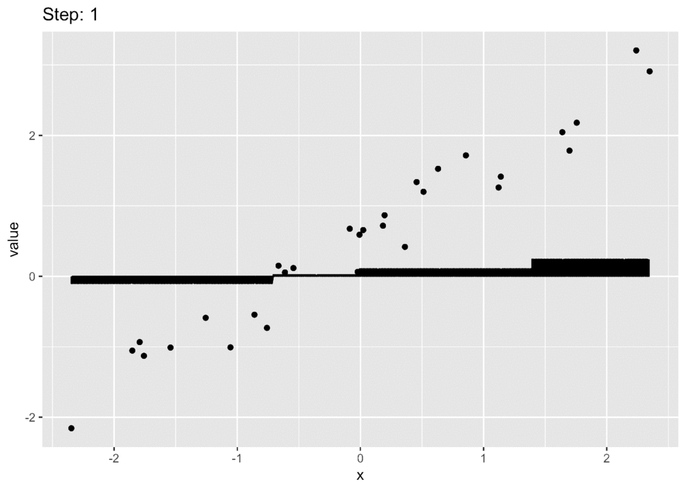

The code presentation used for this lecture can be viewed [here](https://pointofive.github.io/Mod_12_Live.html).  You can also [Downloading](Mod_12_Live.html) and open the html file directly on your local computer; or, if you are a savvy RStudio user, you may download and run the [code](Mod_12_Live.Rmd) directly.  

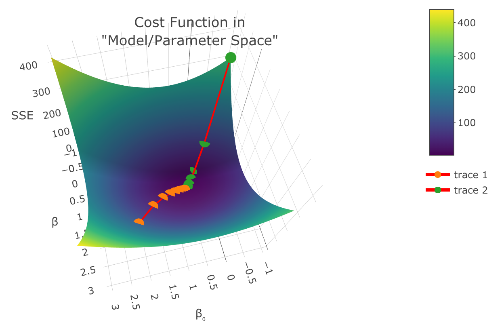

As indicated throughout the content, the lecture alternates between (a) the visualization presentations demonstrating different aspects of the methodolgy and (b) promps given to the class to help keep students engaged as well as more clear on the important take-away points of the presentations.  The prompts used for this class are below.  

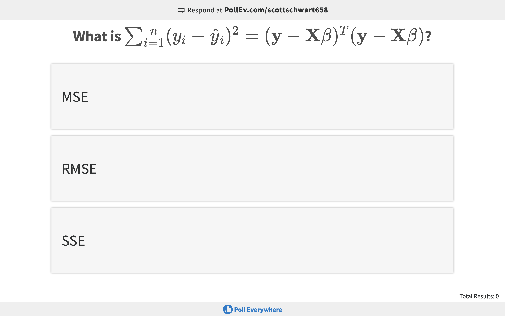
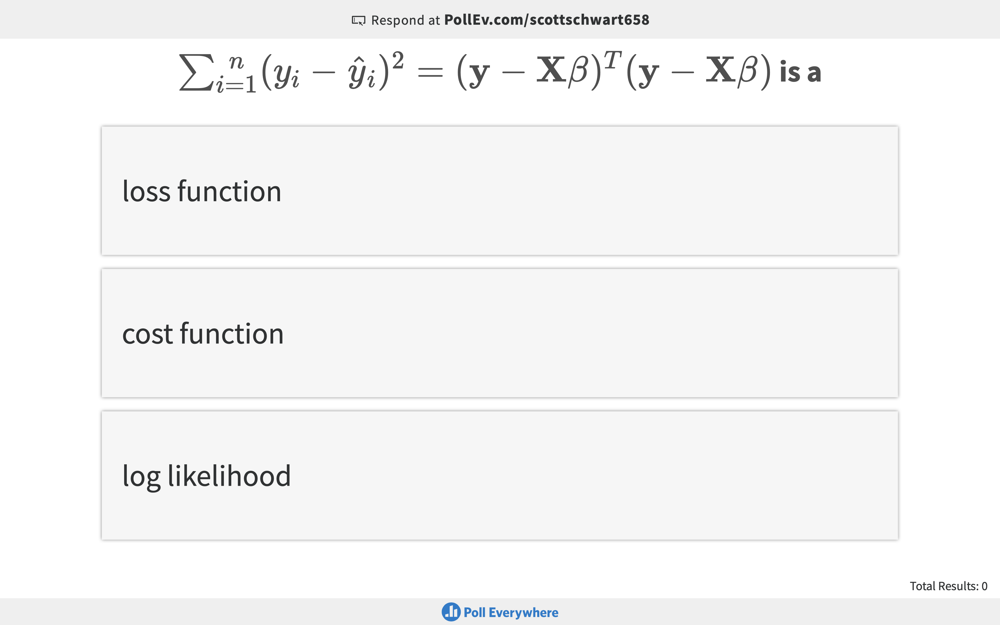
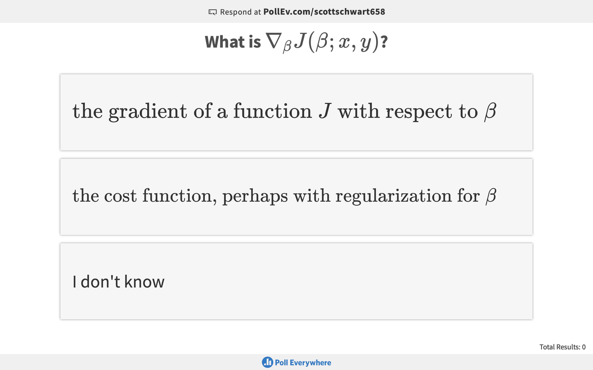
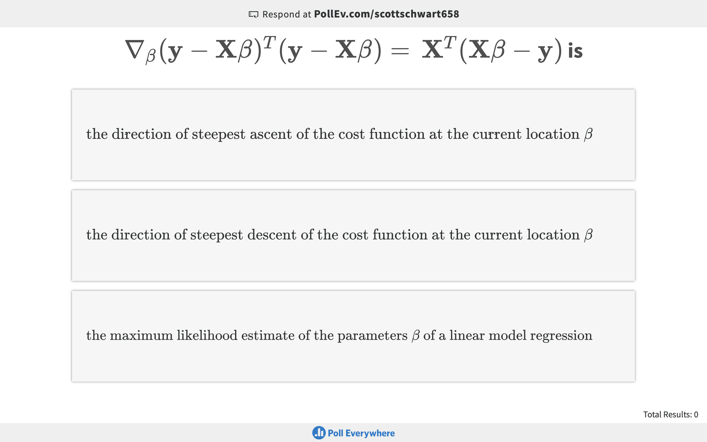
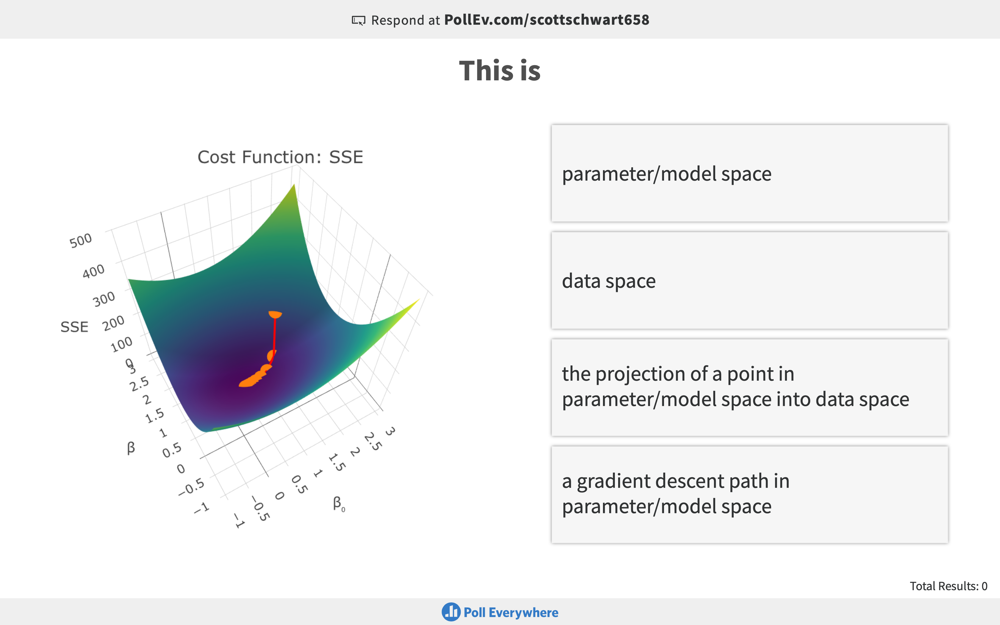
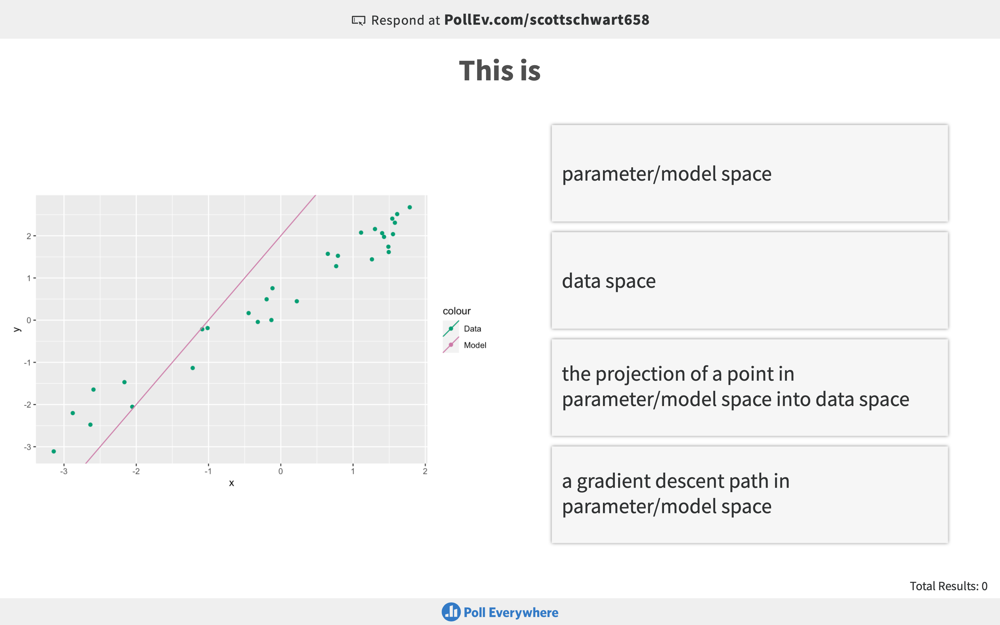
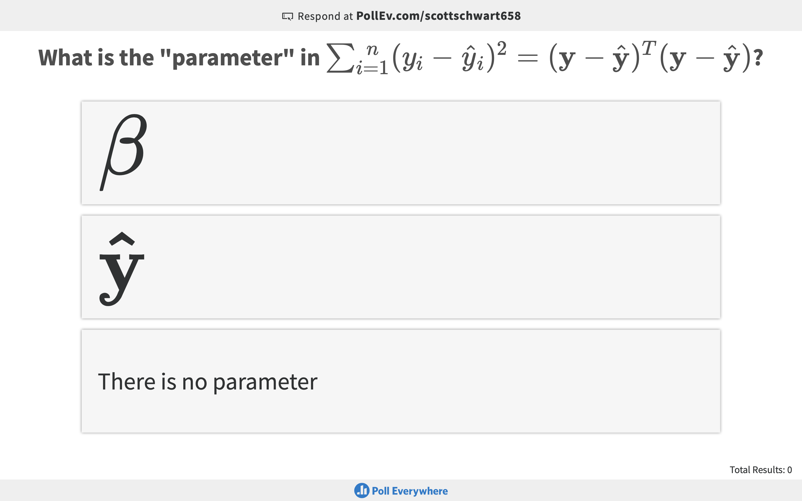
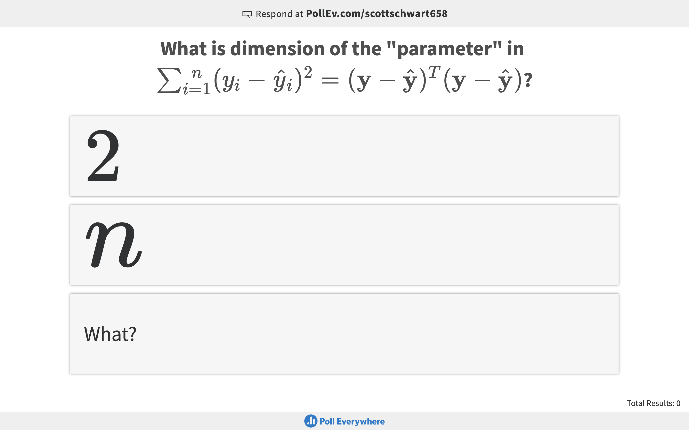
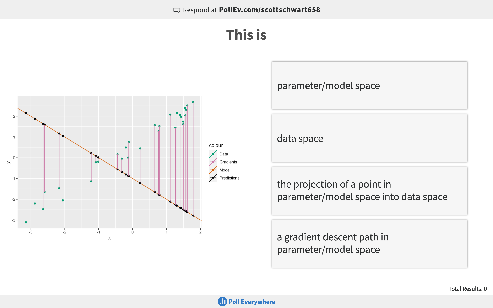
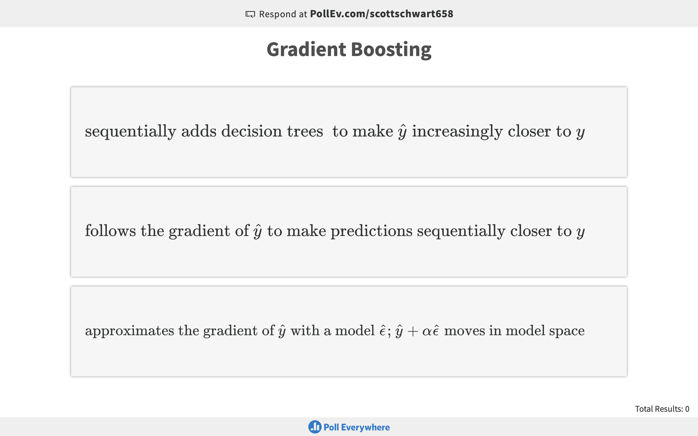
