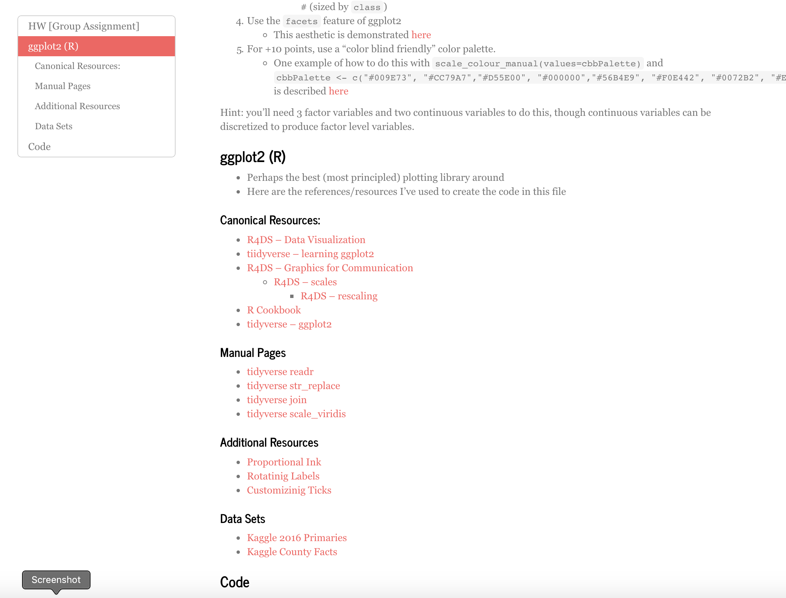

# Scott L. Schwartz, Ph.D. 
## Example Lectures

- [Data Mining](#data-mining)
  - [Syllabus](#data-mining-syllabus)
  - [Example Lecture](#data-mining-example-lecture-gradient-boosting)

- [Communicating with Data](#communicating-with-data)
  - [Syllabus](#communicating-with-data-syllabus)
  - [Example Lecture #1](#communicating-with-data-example-lecture-learning)
  - [Example Lecture #2](#communicating-with-data-example-lecture-ggplot2)

- [Deep Learning](#deep-learning)
  - [Syllabus](#deep-learning-syllabus)
  - [Example Lecture](#deep-learning-example-lecture-cnns)

- [Data Science Immersive Content](#data-science-immersive)

# Data Mining

- More accurately titled as "ISLR Machine Learning"
- Taught to UVA Online MSDS Students
  - material is largely asynchronous
  - with one one-hour lecture given per week

My "live session" lectures for this class alternatingly combine (a) interactive plotting demonstrations of the methodologies usually using shiny or plotly with (b) PollEverwhere promts to reinforce and clarify the key lessons of the visualizations.  My lecturing style welcomes interactivity and questioning from students.

## Data Mining Syllabus

### Weekly Assignments

- Read Topic Chapter in [ISLR](http://faculty.marshall.usc.edu/gareth-james/ISL/) (25-50 pages)
- Watch recorded videos (~60 minutes)
- Try out Lab (~10 pages)
- Do online quizzes (~10-15 questions)

| Week | Topic    |
|------|----------|
| 1    | Syllabus |
| 2    | Introduction      |
| 3    | Linear Regression |
| 4    | Classification    |
| 5    | Sampling Methods  |
| 6    | Model Selection and Regularization |
| 7    | Splines and LOESS |
| 8    | Decision Trees    |
| 9    | Random Forests    |
| 10   | Support Vector Machines |
| 11   | PCA, K-mean, and Clustering |
| 12   | Neural Networks |
| 13   | Gradient Boosting |

## Data Mining Example Lecture: Gradient Boosting

*The code presentation used for this lecture can be viewed [here](https://pointofive.github.io/Mod_12_Live.html).  You can also [Download](Mod_12_Live.html) and open the html file directly on your local computer; or, if you are a savvy RStudio user, you can download and run the [code](Mod_12_Live.Rmd) directly.*

As a representative example of the teaching style and approach I use for this class I below provid a cople highlights of the content of my lecture on gradient descent, as well as the poll questions I use to spark and guide interactive conversation with the class. <!--- You can [view a recording the live session lecture here](path)! -->

As indicated throughout the content, the lecture alternates between (a) the visualization presentations demonstrating different aspects of the methodolgy and (b) promps given to the class to help keep students engaged as well as more clear on the important take-away points of the presentations.  The prompts used for this class are below.  

# Communicating with Data

- Created from scratch during the Spring 2020 semester for the Fall 2021 semester launch of the UVA Undergraduate *Data Science Minor* within the School of Data Science 
- Taught to UVA Undergraduates in an online format while COVID measures were still in place
- Prerequesites for the course are extremely minimal
  - There is no coding requirement for this class
  - Students *are* require to have had any analytical (e.g., statistical) class
- Two 75 minute (online) lectures are given per week
- The course is an "R" course that uses ggplot2, plotly, and shiny

## Communicating with Data Syllabus

This is a "tri-brid" course that uses the trifect of  

(D): discussion (of media publications featureing data presentations),  
(C): implementation (i.e., code walkthroughs demonstrating data plotting), and  
(L): lecture presentation (covering specific relevant considerations)  

to explore and convey "best practices" for communicating with data

There are three kinds of daily assignments in the course:  

(A): find and report on an article
  - these are done with discussion boards and in class conversations  

(P): create a plot with data in R
  - these are started in class and completed as group homework
    - plotting exercises are group assignemnts to facilitate and practice collaboration  

(Q): answer lecture quiz questions
  - these are a combination of online quizzes and in class polls
  - these are frequently used explicitly denoted below as assignments

and there is a midterm (M) and final (F) presentation in which
students present an existing "article" and their own data presentation, 
respectively 

| Week | Class | Lecture               | Assignment              |
|------|-------|-----------------------|-------------------------|
| 1    | 1     | L: Syllabus           | A: Learning             |
| 1    | 2     | L: Learning           | A: Communication        |
| 2    | 3     | L/D: Communication    | A: Conflict Resolution  |
| 2    | 4     | D: "confict skits"    | P: Rstudio Install      |
| 3    | 5     | L/C: R and Python     | P: Format Markdown      |
| 3    | 6     | C: ggplot2            | P: aes() + facets       |
| 4    | 7     | C: Uncertainty        | P: barplot with SE      |
| 4    | 8     | C: Uncertainty II     | P: loess A: Covid Masks |
| 5    | 9     | L/D: Climate Models   | P: time series          |
| 5    | 10    | D: Covid Masks        | A: Fluoridation         |
| 6    | 11    | D: Fluoridation       | A: Election Polling     | 
| 6    | 12    | L/D: Election Polling | A:       tba            |
| 7    | 13    | L/D:     tba          | P: re-create via ggplot |
| 7    | 14    | M: Students Present   | P: re-create via ggplot |
| 8    | 15    | M: Students Present   | P: re-create via ggplot |
| 8    | 16    | M: Students Present   | P: re-create via ggplot |
| 9    | 17    | .                     | .                       |
| 9    | 18    | .                     | .                       |
| 10   | 19    | .                     | .                       |
| 10   | 20    | .                     | .                       |
| 11   | 21    | .                     | .                       |
| 11   | 22    | .                     | .                       |
| 12   | 23    | .                     | .                       |
| 12   | 24    | .                     | .                       |
| 13   | 25    | F: Students Present   | P: re-create via ggplot |
| 13   | 26    | F: Students Present   | P: re-create via ggplot |
| 14   | 27    | F: Students Present   | P: re-create via ggplot |

## Communicating with Data Example Lecture: Learning

In this lecture I report on presentations I've seen discussing
"studies on learning".  I highlight issues with the representations
of the studies; although, ultimately I do attempt to endorse the "findings"
of the studies presented. I include this lecture as an example of "lecture slides" presentations that I give, and as well to give a flavor of the kinds of issues, data presentations and visualizations we are going to be interested in exploring and discussing over the course of the class. 

*The primary two things I would like students to take away from this lecture is to (a) be critical of what the evidence actually is that you are being presented with (because it might not be what it first appears to be), and (b) that uncertainty matters when evaluating the strength of evidence that you are presented with (because not appreciating uncertainty can easily lead to incorrect conclusions). Additionally, I hope they find the ideas presented about learning to be compelling and attempt to incorporate them into their own study and learning patterns.*

- Here are emphasize the "learning barrier" and describe the "new faculty orientation" presentation I will be reporting on

- I highlight these important factors in learning, emphasizing the 3 and 4 in particular as the remainder of the presentation will focus on the first two.

- I prompt students to discuss their discomfort with my "hiding" of this figure

- I describe the features of this figure, it's ostnsible implications, and then engage the class with the subsequent three poll questions 

- I present spaced repetition as it was presented to me, i.e., the work of Ebbinghus

- I present the "forgetting curve" and compare this plot to the plot of the previous slide

- I describe the implications of this figure for the role of spaced representation and learning

- I emphasize the implications of this figure for the role of spaced representation and learning

- I describe the "mechanism" plot and then engage the class with the subsequent three polling questions; in fact, none of this is "data", "spaced repetition" is not something Ebbinghaus explored, and we should not necessarily find this compelling at this stage)

- I note that the Ebbinbhaus' study does not consider spaced repetition

- I provide some "evidence" (**as all the previous plots thusfar have simiply been illustrative**) for spaced repetition and then engage the class with the subsequent polling question; in fact, this "data" is not readily found in the referenced paper, and we have no idea about uncertainty in this data)

- I discuss additional environmental and contextual factors influencing learning and knowledge acquisition

- I show some interesting evidence for one of these factors, and then engage the class with the actual evidence as provided in the cited paper, and the subsequent class poll

## Communicating with Data Example Lecture: ggplot2

*The code presentation used for this lecture can be viewed 
[here](https://pointofive.github.io/ggplot2.html).  
You can also [Download](ggplot2.html) and open the html file directly on your 
local computer; or, if you are a savvy RStudio user, you can download and 
run the [code](ggplot2.Rmd) directly.*

As a representative example of the teaching and lecture style I use for 
"code tutorial" and "lab days" days I have included my initial 
"introduction to ggplot2" material.  While homework assignments 
for "discussion" and "lecture" days for the Communicating with Data class 
generally amount to "Go find an article about 'XYZ' and come back next time 
prepared to present it and discuss it with the class", 
this lecture provides a good illustration of how assignments for
data plotting and figure creation are much more guided and directed,
with the code necessary to complete the assignment provided and demonstrated 
during the course of the lecture.  

# Deep Learning

This class was developed as an online class by Rich Nguyen at UVA
following the content of (firstly) the Goodfellow, Bengio, and Courville
[Deep Learning](https://www.deeplearningbook.org) textbook (D), and
(secondarily) Géron's [Hands-On ML](https://www.oreilly.com/library/view/hands-on-machine-learning/9781491962282/) textbook (H). 

My role with the course was to convert it into an in-person course 
for the residential MS Data Science program at UVA.  
This involved creating content for two 75 minute lectures a week,
which I developed from scratch on the basis of the course textbooks. 

The existing course assignments (including ongoing contribtions to a
semester long course project) originally produced by Rich Nguyen
have been retained in my version of the course; although, my version
of the course adds additional emphasis on practical applied coding 
though my newly developed lecture content.  

One additionally interesting aspect of the course is that I leverage
Rich's (previously developed) recorded (asynchronous online) content 
as additional homework in order to help students 
approach the courses reading content (which is extremely advanced 
and can hence be challenging even for masters level students). 
Students are to watch Rich's presentations, and then attempt the readings
assigned from the textbook. I view this as providing the students
a much *Richer* set of learning mateials than they would normally
otherwise have in any given class. 

In the example lecture I provide below I demonstrate the character
of my lectures of this class; namely, my lectures are structured 
around code implementation examples with class pollilng prompts to
draw student attention to key points of emphasis with respect
to the content of each lecture topic.

## Deep Learning Syllabus

| Week | Class | Topic     | Reading                  | Videos | Assignment        | 
|------|-------|-----------|--------------------------|--------|-------------------|
| 1    | 1     | Syllabus  | LinAlg(D3); NumComp(D4)  | 80min  | NA                |
| 1    | 2     | Python    | ML to Deep Learning(D5)  | 60min  | Python TUTORIAL; Quiz|
| 2    | 3     | ML->DL    | Feed-Forward Networks(D6)| 75min  | NA                |
| 2    | 4     | FFN/GMM   | FFN(D6); Keras TUTORIAL  |  5min  | Code1; Data; Quiz |
| 3    | 5     | FFN Review| Regularization(D7)       | 55min  | PROJECT1 LitReview|
| 3    | 6     | Reg Demo  | Regularization(D7)       |   NA   | DNN TUTORIAL; Quiz|
| 4    | 7     | Reg Review| Optimization(D8)         | 50min  | NA                |
| 4    | 8     | Optimize  | FFN/Reg/Opt (D6-8)       |   NA   | Optimize TUTORIAL |
| 5    | 9     | Optim Demo| FFN/Reg/Opt (D6-8)       |   NA   | PROJECT2 Proposal |
| 5    | 10    | Opt Review| FFN/Reg/Opt (D6-8)       |   NA   | Quiz              |
| 6    | 11    | TF Data   | TensorFlow Data (H13)    | 55min  | CodeA; TF TUTORIAL|
| 6    | 12    | TFDS      | Convolutional NNs(D9)    | 30min  | Quiz              |
| 7    | 13    | CNN       | Convolutional NNs(D9)    | 45min  | CNN TUTORIAL      |
| 7    | 14    | CNN Review| RNN (D10)                |   NA   | Code2; Quiz       |
| 8    | 15    | RNN idea  | LSTM (D10); RNN TUTORIAL | 20min  | PROJECT3 Design   |
| 8    | 16    | LSTM idea |                          |   NA   | Code3             |
| 9    | 17    | Embeddings|                          |        | PROJECT4 Breakdown|
| 9    | 18    | Transformers|                        | 35min  | Quiz              |
| 10   | 19    | Seqential Review| AutoEncoders(H17)  | 30min  | NA                |
| 10   | 20    | VAEs      | GANs(H17); GAN TUTORIAL  | 26min  | PROJECT5 Tuning   |
| 11   | 21    | GANs      |                          |   NA   | CodeB             |
| 11   | 22    | GM Review | RL(H18);                 | 120min | Quiz              |
| 12   | 23    | RL Review |                          |        | RL TUTORIAL       |
| 12   | 24    | Deploying |                          |        | Code4; Quiz       |
| 13   | 25    | ||||
| 13   | 26    | ||||
| 14   | 27    | ||||

## Deep Learning Example Lecture: CNNs

# Data Science Immersive

While teaching and mentoring students in data science methodology I prepared the following lecture and discussion materials

| Applied Topics                                              | Machine Learning                                            | Unsupervised Learning                                                                   |
|:------------------------------------------------------------|:------------------------------------------------------------|:----------------------------------------------------------------------------------------|
[Bokeh Interactive Plotting](http://ec2-3-85-212-72.compute-1.amazonaws.com/)           | [Cost/Benefit Matrix Profit Curves](http://ec2-3-85-212-72.compute-1.amazonaws.com/#cost_benefit)  | [Clustering and Mixture Models](MYLECTURES/kMeansNhierclust/kmeansNhierclust.pdf)                                    |
[Web Scraping/APIs](https://github.com/pointOfive/Home/tree/master/Compute#serverworkers-paradigm)                    | [KNN and Decision Trees](http://ec2-3-85-212-72.compute-1.amazonaws.com/#knn_dt) | [PCA and SVD](MYLECTURES/PCA/pca.pdf)                                                       |
[ML System Production Readiness](http://ec2-3-85-212-72.compute-1.amazonaws.com/#production_readiness)                  | [Bagging/Random Forests](MYLECTURES/baggingANDrfs/bNrf.pdf)        | [Non-negative Matrix Factorization](MYLECTURES/NMF/nmf.pdf)                                                           |
[Amazon Web Services](https://github.com/pointOfive/Home/tree/master/Compute#aws-ec2emrs3)                  | [Gradient Boosting](MYLECTURES/boosting/boosting.pdf)           | [Dimensionality Reduction](MYLECTURES/one_hour_lectures/dimensionality_reduction.ipynb) |
[Natural Language Processing](MYLECTURES/one_hour_lectures/NLPtour.ipynb)                                  |  [Support Vector Machines](MYLECTURES/svm/SVM2.ipynb)                      | [Recommender Systems](MYLECTURES/recsys/rs.pdf)                                         |
[SparkSQL and SparkML](https://github.com/pointOfive/Home/tree/master/Compute#emr-distributed-computing-paradigm)                 | [Neural Networks](MYLECTURES/NN/nn.pdf)             | [Graphs](MYLECTURES/graphs/networks.pdf)                                                |
||||
| **Predictive Methodology**						     | **Statistics**				                  | **Programming**                                                  |
| [Linear Regression](MYLECTURES/reg/reg.pdf )                               | [Probability](MYLECTURES/probs/probs.pdf)                   | [CLI/Linux/git](https://github.com/pointOfive/Home/tree/master/Compute#bash)                                |
| [Interpreting Models](MYLECTURES/one_hour_lectures/interpreting_lms.ipynb) | [Inference/Sampling](MYLECTURES/inference/inference.ipynb)  | [Python](https://github.com/pointOfive/Home/tree/master/Code#coding)                                       |
| [CV/Regularization](MYLECTURES/shrink/regularize.pdf)                      | [Hypothesis Testing I](MYLECTURES/testing/powerNpvalues/testing.ipynb)    | [OOP](https://github.com/pointOfive/Home/tree/master/Analysis#data-pipelining-functionality)                                          |
| [Logistic Regression](MYLECTURES/logistic/logistic.pdf)                    | [Hypothesis Testing II](MYLECTURES/testing/powerNpvalues/tests.pdf)       | [postgreSQL](MYLECTURES/my_sql/sql.pdf)                               |
| [Gradient Descent](MYLECTURES/gradient_decent/gd.pdf)                      | [Power Analysis](MYLECTURES/power_bayes/power/power.ipynb)        | [psychopg2/numpy/pandas](MYLECTURES/pandas/pandas2.ipynb)             |                      
| [Multi-armed Bandit](MYLECTURES/multi-armed-bandit/multi_armed_bandit.pdf) | [Bayesian Analysis](MYLECTURES/one_hour_lectures/bayes.ipynb)     | [Linear Algebra](MYLECTURES/week_3_linmod/linmodreview.pdf)                      |

### Introductory Materials

I additionally developed a very extensive set of self-learning material for probability topics
- [Probability Workshop](Probability)
- [Probability Primer](stats-shortcourse)
- [Probability Review](MYLECTURES/week_2_probstat/probstatreview.pdf)

