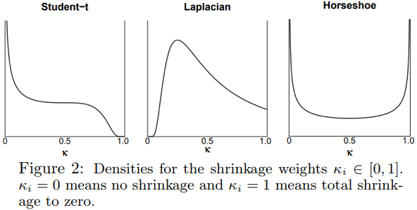
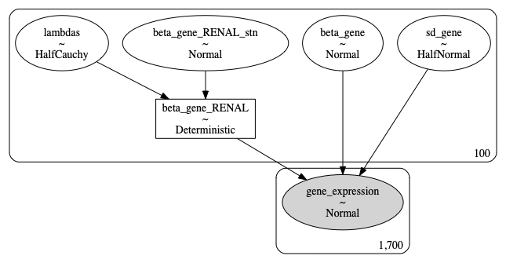

<!--- https://stackoverflow.com/questions/30446905/rmarkdown-font-size-and-header/30447045 --->
<!--- TOC EDITS: /Library/Frameworks/R.framework/Versions/4.0/Resources/library/rmarkdown/rmd/h/default.html --->      
<style type="text/css">

body{ /* Normal  */
      font-size: 24px;
  }

p {
    margin-block-start: 1em;
    margin-block-end: 2em;
}
  
body .main-container {
  max-width: 1500px;
  margin-left: auto;
  margin-right: auto;
}

h1.title {
  font-size: 24px;
}
h4.author {
  font-size: 36px;
}
h4.date {
  font-size: 18px;
}
h1 {
  font-size: 64px;
  padding-top: 10px;
}
h2 {
  font-size: 48px;
}
h3 {
  font-size: 36px;
}
h4 { 
  font-size: 28px;
}
code.r{
  font-size: 18px;
}
pre {
  font-size: 18px
}
td {  /* Table  */
  font-size: 18px;
}

.toc-content {
  padding-left: 100px;
  padding-right: 100px;
}

li{
  margin: 10px 0;
}

</style>

```{r setup, include=FALSE}
knitr::opts_chunk$set(echo=TRUE, warning=FALSE, message=FALSE, 
                      fig.align="center", out.width="100%")
```


# Randomization's Role <br> *in Research Study Design*

A presentation example for teaching non-statistics students with no previous
university-level statistics or math courses. *Designed specifically for the 
interview process for the Department Statistical Science at the University of Toronto.*


## SharYIkEs!

Let's get some *Shark Attack* data from [data.world](https://data.world/shruti-prabhu/shark-attacks)!


#### `tidyverse`

- We're using `tidyverse` again(!)
  - for it's efficient, explicit modern data processing capabilities

```{r tidyverse}
# https://www.tidyverse.org
# install.packages("tidyverse")
# install.packages("kableExtra")
# remotes::install_github('rstudio/rmarkdown')

library(tidyverse)
library(kableExtra)
```


#### Flossing


- We always have to do careful data cleaning
- Here's what I had to do to pull out the months
  - and exclude data that didn't have a month reported 
  - (important momentarily!)
  
  
```{r sharks_data, echo=TRUE}
# https://data.world/shruti-prabhu/shark-attacks
# could also download this directly from the web, here:
# https://query.data.world/s/lsa57qir23vdwphqusrq2nk3d4hkxt
# probably best to download it though if we're gonna work with it for a while!

# 0. https://stackoverflow.com/questions/<below>
# 1. 14363085/invalid-multibyte-string-in-read-csv
# 2. 15564063/apostrophe-turning-into-x92
# 3. 2014069/windows-1252-to-utf-8-encoding
# 4. 56479923/how-do-you-set-encoding-fileencoding-option-in-readr-tidyverse
read_csv("attacks.csv", locale=locale(encoding="WINDOWS-1252")) %>% 
  select(-`Case Number_1`) %>% 
  select(-`Case Number_2`) %>% 
  filter(Country=='USA') %>%
  filter(nchar(Date)>5) %>%
  filter(Date!='1853 or 1854') %>%
  filter(Date!="1900-1905") %>%
  filter(Date!="1898-1899") %>%
  filter(str_detect(Date,'Ca.', negate=TRUE)) %>%
  filter(str_detect(Date,'Circa', negate=TRUE)) %>%
  filter(str_detect(Date,'Before', negate=TRUE)) %>%
  filter(str_detect(Date,'No date', negate=TRUE)) %>%
  filter(str_detect(Date,'Early', negate=TRUE)) %>%
  mutate(Date = str_replace(Date, '--', '-')) %>%
  mutate(Date = str_replace(Date, 'Jan 1858', 'Jan-1858')) %>%
  mutate(Date = str_replace(Date, 'Aug-24-1806', '24-Aug-1806')) %>%
  mutate(Date = str_replace(Date, 'May-17-1803', '17-May-1803')) %>%
  mutate(Date = str_replace(Date, 'July', 'Jul')) %>%
  mutate(Date = str_replace(Date, 'Sept', 'Sep')) %>%
  mutate(Date = str_replace(Date, 'Sep or ', '25-')) %>%
  mutate(Date = str_replace(Date, 'Mid ', '25-')) %>%
  mutate(Date = str_replace(Date, 'Late ', '05-')) %>%
  mutate(Date = str_replace(Date, 'Summer ', '01-Jul-')) %>%
  mutate(Date = str_replace(Date, 'Reported ', '')) %>%
  mutate(Date = str_replace(Date, '     ', '')) %>%
  mutate(Date = if_else(nchar(Date)==6, paste0('01-',Date), Date)) %>%
  mutate(Date = if_else(nchar(Date)==8, paste0('01-',Date), Date)) %>%
  # https://tidyr.tidyverse.org/reference/separate.html
  separate(Date, c('year','month','day'), sep='-', remove=FALSE) %>%
  drop_na(month) -> sharks
```


#### Readibilty

- Look how human readable this tidy code is!
  - I use `select`, `filter`, and  (especially) `mutate` all the time
  - but `separate` is a new cool feature I've never used before
  - `read_csv` and `drop_na` are old standards
  - Watch out for character encoding!


```{r sharks_data_show, echo=FALSE}
# https://haozhu233.github.io/kableExtra/awesome_table_in_html.html
# https://stackoverflow.com/questions/40840986/knitrkable-is-there-a-way-to-reduce-the-font-size/44411700
sharks %>% head(100) %>% kbl() %>%
  kable_styling(font_size=12) %>% scroll_box(width = "100%", height = "500px")
```


## Raise the Sales! 

Let's get some *Ice Cream Sales* data from the [Federal Reserve](https://fred.stlouisfed.org/series/IPN31152N)!
A.K.A. IPN31152N:

- Industrial Production
  - Manufacturing
    - Non-Durable Goods
      - Ice Cream and Frozen Dessert (NAICS = 31152)


#### Dates 

- It's *much nicer* when the dates are uniformly formatted...
  - The `lubridate` library is representative of standard manipulation functionality


```{r ice_cream_data}
# https://fred.stlouisfed.org/series/IPN31152N
i_scream <- read_csv("IPN31152N.csv")

# https://lubridate.tidyverse.org
# https://stackoverflow.com/questions/33221425/how-do-i-group-my-date-variable-into-month-year-in-r
i_scream <- i_scream %>% 
  mutate(month = lubridate::month(DATE, label = TRUE))
```

```{r ice_cream_data_show, echo=FALSE}
library(plotly)

# https://stackoverflow.com/questions/11748384/formatting-dates-on-x-axis-in-ggplot2
i_scream[6:dim(i_scream)[1],] %>% ggplot(aes(x=DATE, y=IPN31152N)) + 
  geom_line() + theme(axis.text.x=element_text(angle=60, hjust=1)) +
  scale_x_date(date_breaks = "6 month", date_labels =  "%b %Y")  -> i_scream_plot
ggplotly(i_scream_plot) 
```


## I Scream $\implies$ Shark Attacks

Here are the monthly totals of *Shark Attacks*, 
and the average *Industrial Ice Cream Production* (IPN31152N index).


### Evidence?

- `tidy` does standard `group_by` and `inner_join` table operations


```{r sharks_iscream, echo=FALSE}

sharks <- sharks %>% group_by(month) %>% count() %>% 
  rename(`Total Shark Attacks`=n)

# https://dplyr.tidyverse.org/reference/group_by.html
# https://dplyr.tidyverse.org/reference/count.html
# https://dplyr.tidyverse.org/reference/summarise.html
i_scream %>% select(month, IPN31152N) %>%
  group_by(month) %>% 
  summarize(`Average Ice Cream Sales`=mean(IPN31152N)) -> i_scream

sharks %>% inner_join(i_scream) %>% rename(Month=month) -> sharks_i_scream 
sharks_i_scream %>% kbl() %>% kable_styling()
```

<!--- https://bookdown.org/yihui/rmarkdown-cookbook/fold-show.html --->

```{r sharks_iscream_plot, class.source='fold-hide'}
# , fig.height=7, fig.width=7, out.width="75%"}
# https://stackoverflow.com/questions/<below>
# 14942681/change-size-of-axes-title-and-labels-in-ggplot2
# 28243514/ggplot2-change-title-size
# 23527385/place-y-axis-on-the-right

ggplot(sharks_i_scream, 
       mapping=aes(x=`Average Ice Cream Sales`, 
                   y=`Total Shark Attacks`,
                   label=Month)) + 
  geom_smooth(method='lm') + geom_text() + 
  ggtitle('Sharks attacks are more prevalent when we eat more Ice Cream!') +
  annotate("text", x=90, y=370, size=6,
           label='Duh-Duh, Duh-Duh...', color='gray') +
  annotate("text", x=128, y=-20, size=6,
           label='Nom! Nom! Nom! Nom!', color='gray') +
  theme(axis.title=element_text(size=14),
        plot.title=element_text(size=15)) + 
  scale_y_continuous(position = "right")
  

```


### Correlation *is not* Causation!

How would ice cream production mechanistically influence
shark attacks?

- What would be a better explanation?
  - Time of the year?
    - Mechanism for influencing ice cream eating behavior?
    - Mechanism for influencing beach attendance behavior?
    
    
```{r reskins, class.source='fold-hide', fig.height=7, fig.width=7, out.width="80%"}
library(gridExtra)

a_plot <- sharks_i_scream %>%
    ggplot(mapping=aes(x=`Average Ice Cream Sales`, 
                       y=`Total Shark Attacks`)) + 
    geom_point() + geom_smooth(method='lm') +
    coord_cartesian(ylim=c(50, 340)) + 
    theme(axis.title=element_text(size=12),
          plot.title=element_text(size=15))


#no_ticks <- theme(axis.text.x = element_blank(),
#                  axis.text.y = element_blank())

# http://www.sthda.com/english/articles/24-ggpubr-publication-ready-plots/81-ggplot2-easy-way-to-mix-multiple-graphs-on-the-same-page/
grid.arrange(grobs = list(a_plot + geom_text(aes(label=Month),
                                             vjust="inward", hjust="inward") + 
                                   ggtitle("(A) Counfounding"),
                          a_plot + labs(x='Coffeine Consumption', 
                                        y='Productivity') + 
                                   ggtitle("(B) Causality"),
                          a_plot + labs(x='Height', y='Weight') + 
                                   ggtitle("(C) Complexity"),
                          a_plot + labs(x='Dosage', y='Response') + 
                                   ggtitle("(D) Intervention")),
             nrow=2, aspect=TRUE)
```


#### Caffeine/Productivity

- What is the direction of causality?
  - Are you working because you're drinking coffee; or
    - are you drinking coffee because you're working

#### Height/Weight

- What *other* factors effect weight?
  - Suppose this data uses a population of statisticians:
    - how would the picture change in a population of children?

#### Treatment/Responce

- Could this association mislead us?
  - What if the treatment is self-selected?
    - E.g., aspirin usage and inflammation 

### Observation *VS* Experimentation

```{r reskins_2, class.source='fold-hide', fig.height=3.5}
# install.packages('latex2exp')
library(latex2exp)

a_plot <- sharks_i_scream %>%
    ggplot(mapping=aes(x=`Average Ice Cream Sales`, 
                       y=`Total Shark Attacks`)) + geom_point()

# http://www.sthda.com/english/articles/24-ggpubr-publication-ready-plots/81-ggplot2-easy-way-to-mix-multiple-graphs-on-the-same-page/
grid.arrange(a_plot + labs(x=latex2exp::TeX('Uncontrolled Observed Treatment $(X)$'), 
                           y=latex2exp::TeX('Observed Outcome $(Y)$')) + 
                      ggtitle("(E) Observational Study"),
             a_plot + labs(x=latex2exp::TeX('Controlled Treatment Assignment $(T)$'), 
                           y=latex2exp::TeX('Observed Outcome $(Y)$')) + 
                      ggtitle("(F) Controlled Experiment"),
             ncol=2, respect=TRUE)
```

#### Some Maths

- $Y$: Outcome <em style="color:SkyBlue">[Inflammation Reduction]</em>
- $X$: Intervention <em style="color:SkyBlue">[Aspirin]</em>
- $Z$: Confounder <em style="color:SkyBlue">[Sprain Severity]</em>

Is there something that can *guess* the *Intervention*?

<p style="color:black">$$\huge \textrm{ Is } f(X|Y) \textrm{ actually } f(X|Y,Z)?$$</p>

- $T$: Unconfounded Intervention

<p style="color:green">$$\huge f(X|Y,Z) = f(X|Y) = f(T|Y)$$</p>

*Bonus: this concept is called* ***propensity scores!***


```{r confounding, class.source='fold-hide', out.width="100%"}
sharks_i_scream %>% rename(Treatment=`Average Ice Cream Sales`, 
                           Outcome=`Total Shark Attacks`) %>%
  mutate(Confounder=Treatment+Outcome) -> XYZ
  
# https://plotly.com/r/3d-subplots/
ax <- list(
  title = 'Confounder',
  zeroline = FALSE,
  showline = FALSE,
  showticklabels = FALSE,
  showgrid = FALSE
)

# https://community.plotly.com/t/droplines-from-points-in-3d-scatterplot/4113/11
XYZ_floor <- replicate(2, XYZ, simplify = F)
XYZ_floor[[2]]$Confounder <- 0
XYZ_floor <- XYZ_floor %>% bind_rows()

scene1 = list(camera=list(eye=list(x=-.000001, y=-.01, z=3)),
              zaxis=ax)

plot_ly(scene='scene1', showlegend=FALSE) %>%
        add_markers(data=XYZ, marker=list(color='black'),
                    x=~Treatment, y=~Outcome, z=~Confounder)  %>%
        add_paths(data=XYZ_floor, line=list(color='black'),
                  x=~Treatment, y=~Outcome, z=~Confounder) -> confounder

XYZ %>% mutate(Confounder=100+0*Confounder) -> XYZ2
XYZ2_floor <- replicate(2, XYZ2, simplify = F)
XYZ2_floor[[2]]$Confounder <- 0
XYZ2_floor <- XYZ2_floor %>% bind_rows()
XYZ %>% mutate(Confounder=50+0*Confounder) -> XYZ2

axx <- list(title = "Treatment", automargin = TRUE)
axy <- list(title = "Outcome", automargin = TRUE)
scene2 = list(camera=list(eye=list(x=-.000001, y=-.01, z=3)),
              zaxis=ax, xaxis=axx, yaxis=axy)

plot_ly(scene='scene2', showlegend=FALSE) %>%
        add_markers(data=XYZ2, marker=list(color='green'),
                    x=~Treatment, y=~Outcome, z=~Confounder)  %>%
        add_paths(data=XYZ2_floor, line=list(color='green'),
                  x=~Treatment, y=~Outcome, z=~Confounder) -> no_confounder

subplot(confounder, no_confounder) %>% 
  layout(scene=scene1, scene2=scene2, margin = list(pad = 10))

```


### Randomization *to the Rescue!*


- By what mechanism might you try to ensure that your Treatment Assignment
is not a *Confounded Treatment Assignment*?
  - I.e., is not accidentally confounded with the *Outcome*?
  

```{r randomization2theRescue, class.source='fold-hide'}
XYZ %>% mutate(Confounder=100+0*Confounder) -> XYZ2
XYZ2 %>% add_column(size=.1, color='green') -> XYZ2
n <- 20
XYZ2_floor <- replicate(n, XYZ2, simplify = F)
for(i in 1:20){
  if(i<=10)
    XYZ2_floor[[i]]$Confounder <- (i-1)*100/n
  else
    XYZ2_floor[[i]]$Confounder <- i*100/n
}
XYZ2_floor <- XYZ2_floor %>% bind_rows()
XYZ %>% mutate(Confounder=50+0*Confounder) -> XYZ2
XYZ2 %>% add_column(size=10, color='blue') -> XYZ2

axx <- list(title = "Treatment", automargin = TRUE)
axy <- list(title = "Outcome", automargin = TRUE)
scene1 = list(camera=list(eye=list(x=-.000001, y=-.01, z=3)),
              zaxis=ax, xaxis=axx, yaxis=axy)

plot_ly(scene='scene1', showlegend=FALSE) %>%
        add_markers(data=XYZ2_floor, size=~size, sizes=c(10,25), 
                    marker=list(symbol='circle', sizemode='diameter', 
                                color='blue'),
                    x=~Treatment, y=~Outcome, z=~Confounder)  %>%
        add_markers(data=XYZ2, size=~size, sizes=c(10,25), 
                    marker=list(symbol='circle', sizemode='diameter',
                                color='green'),
                    x=~Treatment, y=~Outcome, z=~Confounder) -> uni

XYZ %>% mutate(Confounder=100+0*Confounder) -> XYZ2
XYZ2 %>% add_column(size=.1, color='green') -> XYZ2
n <- 20
XYZ2_floor <- replicate(n, XYZ2, simplify = F)
for(i in 1:20){
  if(i<=10)
    XYZ2_floor[[i]]$Confounder <- rnorm(12,50,20)
  else
    XYZ2_floor[[i]]$Confounder <- rnorm(12,50,20)
}
XYZ2_floor <- XYZ2_floor %>% bind_rows()
XYZ %>% mutate(Confounder=50+0*Confounder) -> XYZ2
XYZ2 %>% add_column(size=10, color='blue') -> XYZ2

axx <- list(title = "Treatment", automargin = TRUE)
axy <- list(title = "Outcome", automargin = TRUE)
scene2 = list(camera=list(eye=list(x=-.000001, y=-.01, z=3)),
              zaxis=ax, xaxis=axx, yaxis=axy)

plot_ly(scene='scene2', showlegend=FALSE) %>%
        add_markers(data=XYZ2_floor, size=~size, sizes=c(10,25), 
                    marker=list(symbol='circle', sizemode='diameter', 
                                color='blue'),
                    x=~Treatment, y=~Outcome, z=~Confounder)  %>%
        add_markers(data=XYZ2, size=~size, sizes=c(10,25), 
                    marker=list(symbol='circle', sizemode='diameter', 
                                color='green'),
                    x=~Treatment, y=~Outcome, z=~Confounder) -> rand

subplot(uni, rand) %>% 
  layout(scene=scene1, scene2=scene2, margin=list(pad=0))

```

**One More Important Benefit:**
*by randomly sampling from from the "population*
*we also make our treatment groups representative*
*of that population*

  

# *The* Horseshoe *Prior*

A presentation example for teaching Upper-Year Statistics Major students. *Designed specifically for the interview process for the Department Statistical Science at the University of Toronto.*

## Regularization

### $L_2$ (Ridge)

- Also known as *Tikhonov* regularization
- Corresponds to an analyss with a *Gaussian* or *Normal* Prior


$$
\begin{align*}
\hline
\log \prod_{i=1}^n \frac{1}{\sqrt{2\sigma}}e^{-\frac{1}{2}\left(\frac{y_i-\mathbf{x}_i^\intercal \boldsymbol{\beta}}{ \Large \sigma}\right)^2} {} = & 
\sum_{i=1}^n  \log \frac{1}{\sqrt{2 \sigma}} - \sum_{i=1}^n \frac{1}{2}\left(\frac{y_i-\mathbf{x}_i^\intercal \boldsymbol{\beta}}{\large \sigma}\right)^2 \\\\\hline
{}\\
\log \left(\left( \prod_{i=1}^n \frac{1}{\sqrt{2\sigma}}e^{-\frac{}{2}\left(\frac{y_i-\mathbf{x}_i^\intercal \boldsymbol{\beta}}{\large \sigma}\right)^2} \right) 
(2\sigma_0)^{-p/2} 
e^{-\frac{(\boldsymbol{\beta}-\boldsymbol{\beta}_0)^\intercal(\boldsymbol{\beta}-\boldsymbol{\beta}_0)}{2\sigma_0^p}}
\right) {} = & 
\sum_{i=1}^n  \log \frac{1}{\sqrt{2\sigma}} - \sum_{i=1}^n \frac{1}{2}\left(\frac{y_i-\mathbf{x}_i^\intercal \boldsymbol{\beta}}{\large \sigma}\right)^2 + \\
 & {} 
\log \left((2\sigma_0)^{-p/2}\right) - \frac{(\boldsymbol{\beta}-\boldsymbol{\beta}_0)^\intercal(\boldsymbol{\beta}-\boldsymbol{\beta}_0)}{2\sigma_0^p} \\\\\hline
\\
\Large \textrm{Loss} + \textrm{Penalty} \quad\quad\quad \normalsize {} = & 
\sum_{i=1}^n \frac{1}{2}\left(y_i-\mathbf{x}_i^\intercal \boldsymbol{\beta}\right)^2 + \lambda \sum_{k=1}^{p} \beta_k^2 \\\hline
\end{align*} 
$$

### $L_1$ (Lasso)

- Corresponds to an analyss with a *Double Exponential* or *Laplace* Prior


$$
\begin{align*}
\hline
\log \prod_{i=1}^n \frac{1}{\sqrt{2\sigma}}e^{-\frac{1}{2}\left(\frac{y_i-\mathbf{x}_i^\intercal \boldsymbol{\beta}}{\Large \sigma}\right)^2} {} = & 
\sum_{i=1}^n  \log \frac{1}{\sqrt{2 \sigma}} - \sum_{i=1}^n \frac{1}{2}\left(\frac{y_i-\mathbf{x}_i^\intercal \boldsymbol{\beta}}{\large \sigma}\right)^2 \\\\\hline
{}\\
\log \left(\left( \prod_{i=1}^n \frac{1}{\sqrt{2\sigma}}e^{-\frac{}{2}\left(\frac{y_i-\mathbf{x}_i^\intercal \boldsymbol{\beta}}{\large \sigma}\right)^2} \right) 
\prod_{k=1}^p
\frac{1}{2b_{k0}} 
e^{-\frac{|\beta_k-\beta_{k0}|}{b_{k0}}}
\right) {} = & 
\sum_{i=1}^n  \log \frac{1}{\sqrt{2\sigma}} - \sum_{i=1}^n \frac{1}{2}\left(\frac{y_i-\mathbf{x}_i^\intercal \boldsymbol{\beta}}{\large \sigma}\right) + \\
 & {} 
\sum_{k=1}^{p} \log \frac{1}{2b_{k0}} - 
\sum_{k=1}^{p} \frac{|\beta_k-\beta_{k0}|}{b_{k0}}\\\\\hline
\\
\Large \textrm{Loss} + \textrm{Penalty} \quad\; \normalsize {} = & 
\sum_{i=1}^n \frac{1}{2}\left(y_i-\mathbf{x}_i^\intercal \boldsymbol{\beta}\right)^2 + \lambda \sum_{k=1}^{p} |\beta_k| \\\hline
\end{align*} 
$$


## Shrinkage

<p>
- <u>Regularization</u> is adding a *penalty* to the loss function to stabilize model estimation
- <u>Shrinkage</u> is *regularization* where model coefficients are pulled towards $0$
in order to stabilize model estimation
  - I.e. prior locations are set at $\boldsymbol{\beta}_0 = 0$
</p>

<p>
- You have probably seen this plot like before, but now let's see how it's made
  - These range from *ZERO* $(\kappa=0)$ to *complete* ($\kappa=1$) shrinkage 
</p>

|   |
|:-:|
||
|([Handling Sparsity via the Horseshoe](https://faculty.mccombs.utexas.edu/carlos.carvalho/Carvalhoetal2009.pdf))|

<p>
- The *shape* shrinkage is controlled by the *prior*!
  - $L_2$: The *Cauchy* (*Student-t* with *df=1*) prior
    - *never* applies complete shrinkage $(\kappa \not = 1 \implies \beta_k \not = 0)$ 
    - This shrinkage profile is similar to the *Gaussian* prior
  - $L_1$: The *Laplace* (or *Double Exponential*) prior 
    - *can* achieve total shrinkage $(\kappa = 1 \implies \beta_k = 0)$ 
    - but it also does not shrink at all $(\kappa=0)$
  - $U?$: The *Horseshoe* can achieve both **both** 
    - *complete* $(\kappa=1)$  as well as *ZERO* shrinkage $(\kappa=0)$
</p>

|   |
|:-:|
||
|([Bayesian regularization: From Tikhonov to horseshoe](https://onlinelibrary.wiley.com/doi/abs/10.1002/wics.1463))|

- Ridge shrinks *both* X and Y directions, but neither exactly to $0$
- Lasso shrinks *both* X and Y directions, one direction exactly to $0$
- Horseshoe shrinks *only* X *or* Y directions, one direction exactly to $0$

### Horseshoe

<!--- \lambda &\sim HC_+(1)\\ --->

 

$$
\huge
\begin{align*}
\beta_i|\lambda_i,\tau &\sim N(0, \sigma^2=\tau^2\lambda_i^2)\\
\lambda_i &\sim HC_+(1)\\
\\\hline
\\
\beta_i | \tau & \sim {} HSP(\tau)\\
\end{align*}
$$

#### Half-Cauchy

$$\Large 
\begin{align*}
\underset{\in \mathbb{R}_+}{\lambda_i} & \sim {} HC_+(\gamma) \\
f(\lambda_i \mid \gamma) & = {} \frac{2\cdot 1_{[\lambda_i>=0]}(\lambda_i)}{\pi \gamma \left[1 + \left(\frac{\lambda_i}{\gamma}\right)^2\right]} 
\end{align*}
$$

#### Likelihood

The *posterior distribution* of a normal-normal specification is [well-known](https://en.wikipedia.org/wiki/Conjugate_prior#When_likelihood_function_is_a_continuous_distribution):

$$
\Large
\begin{align*}
Y_i|\beta_i &\sim N(\beta_i, \sigma^2_Y=1)\\
\beta_i|\lambda_i,\tau=1 &\sim N(0, \sigma^2=\lambda_i^2)\\\\
\implies \beta_i|Y_i, \lambda_i,\tau=1 & \sim {} N \left(Y_i\frac{1}{\frac{1}{\lambda_i^2} + 1}, \sigma^2=\frac{1}{\frac{1}{\lambda_i^2} + 1} \right)\\
\\
\hline\\
\implies E[\beta_i|Y_i, \lambda_i] & = {} Y_i\frac{\lambda_i^2}{1 + \lambda_i^2} \\
& = {} Y_i\frac{\lambda_i^2}{1 + \lambda_i^2} + 0 \underbrace{\left(\frac{1}{1 + \lambda_i^2} \right)}_{\kappa_i}\\
& = {} Y_i (1 - \kappa_i) + 0 \kappa_i 
\end{align*}
$$

<p>
- $\kappa_i=1$: complete shrinkage
- $\kappa_i=0$: zero shrinkage
</p> 

### Horseshoe Shrinkage Profile

- But why is the "horseshoe" shrinkage profile "U"-shaped?? 
- Let's derive the distribution of $\kappa_i$ (based on the distribution of $\lambda_i$)

#### Change of Variables

$$
\Large
\begin{align*}
\underset{\in[0,1]}{\kappa_i} = \frac{1}{1+\underset{\in \mathbb{R}_+}{\lambda_i^2}} & \implies {} \frac{1}{\kappa_i}-1 = \lambda_i^2  \\
& \implies {} \lambda_i = \sqrt{\frac{1}{\kappa_i}-1}\\\\\hline
\\
\frac{d \lambda_i}{d \kappa_i} & \underset{rule}{\overset{chain}{=}} {} \frac{1}{2}\left(\frac{1}{\kappa_i}-1\right)^{-\frac{1}{2}}  \left(-1\kappa_i^{-2}\right)
\\\\\hline
\end{align*} 
$$


$$
\large
\begin{align*}
& \quad\;\; {} \int_{a\in \mathbb{R}_+}^{b\geq a} f_{_{\lambda_i}}(\lambda_i) d \lambda_i\\
& ={} \int_{\frac{1}{1+a^2} \in [0,1]}^{0 \leq \frac{1}{1+b^2} \leq \frac{1}{1+a^2}} f_{_{\lambda_i}}\left(\sqrt{\frac{1}{\kappa_i}-1}\right) \frac{d \lambda_i}{d \kappa_i} d \kappa_i\\
 & ={} - \int^{\frac{1}{1+a^2} \in [0,1]}_{0 \leq \frac{1}{1+b^2} \leq \frac{1}{1+a^2}} f_{_{\lambda_i}}\left(\sqrt{\frac{1}{\kappa_i}-1}\right) \frac{1}{2}\left(\frac{1}{\kappa_i}-1\right)^{-\frac{1}{2}}  (-1\kappa_i^{-2}) d \kappa_i\\
 & ={} - \int^{\frac{1}{1+a^2} \in [0,1]}_{0 \leq \frac{1}{1+b^2} \leq \frac{1}{1+a^2}} 
 \frac{2}{\pi  \left[1 + \left(\sqrt{\frac{1}{\kappa_i}-1}\right)^2\right]}
 \frac{1}{2}\left(\frac{1}{\kappa_i}-1\right)^{-\frac{1}{2}}  (-1\kappa_i^{-2}) d \kappa_i\\
 & ={} \int^{\frac{1}{1+a^2} \in [0,1]}_{0 \leq \frac{1}{1+b^2} \leq \frac{1}{1+a^2}} 
\frac{1}{\pi } \left(\frac{1-\kappa_i}{\kappa_i}\right)^{-\frac{1}{2}} \kappa_i^{-1} d \kappa_i
\\\\
 & ={} \int^{\frac{1}{1+a^2} \in [0,1]}_{0 \leq \frac{1}{1+b^2} \leq \frac{1}{1+a^2}} 
\frac{\Gamma(1)}{\Gamma(\frac{1}{2}) \Gamma(\frac{1}{2})} (1-\kappa_i)^{\frac{1}{2}-1} {\kappa_i}^{\frac{1}{2}-1} d \kappa_i\\\\\hline
\end{align*} 
$$


#### Language or Library? {.tabset}

##### `Reticulate!`

- Loading the `reticulate` lets me run a `python` in `R`!

```{r reticulate}
library(reticulate)
# conda_list()
use_condaenv("PyMC", required=TRUE)
```

##### `Python!`

- Like this!
- Here's the *beta* distribution implied by the *horseshoe* prior
  - from the (*great*) `scipy.stats` library

```{python beta}
import numpy as np
from scipy import stats

support_beta = np.linspace(0,1,100)[1:-1]
pdf_beta = stats.beta(a=1/2, b=1/2).pdf(support_beta)
```

- And here we implement the change of variables calculation with `python`

$$\begin{align*}\\
\Large g_{\kappa_i}(\kappa_i) = f_{\lambda_i} \left(\lambda_i =  \sqrt{\frac{1}{\kappa_i}-1}\right) \left|\frac{d \lambda_i}{d\kappa_i}\right|
\end{align*}$$

```{python transformed_cauchy}
support_cauchy = (1/support_beta-1)**0.5
pdf_cauchy = stats.halfcauchy.pdf(support_cauchy)
abs_dx_wrt_dy = .5*(1/support_beta-1)**(-.5) * support_beta**(-2)
pdf_transformed_cauchy = pdf_cauchy * abs_dx_wrt_dy
```

##### `R!`

- And here we can bring back the results back in `R` for interactive use
  - `reticulate` `python` sessions in `RStudio` are still very `R`-centric
    - E.g., errors for debugging need to be explicitly requested
    - E.g., `matplotlib` can be output directly, but not `plotly`

```{r python2R}
x <- py$support_beta
beta_pdf <- py$pdf_beta
transformed_cauchy_pdf <- py$pdf_transformed_cauchy
```

```{r distribution_plots, class.source='fold-hide'}
tibble(x=x, `f(x)`=beta_pdf) %>% 
  ggplot(aes(x=x, y=`f(x)`, color='Beta')) + 
  geom_line(size=3) + 
  ggtitle(latex2exp::TeX(
          '$\\beta = \\alpha = -\\frac{1}{2}$ Beta Distribution')) +
  geom_line(data=tibble(x=x, y=transformed_cauchy_pdf),
            mapping=aes(x=x, y=y, color='Transformed Cauchy'), 
            linetype='dashed', size=2) +
  scale_color_manual(values=c("black","yellow"))


```

##### `NCI60`

- We'll use the [NCI60 data]([https://dtp.cancer.gov/discovery_development/nci-60/), specifically:
  - gene expression for `MELANOMA` ($n=8$) and `RENAL` ($n=9$) cancer cell lines

```{r NCI60}
library(ISLR)
nci60 <- NCI60
```

- Which we'll tentatively normalize, however
  - this choice to address systematic bias needs to be explored more thoroughly

```{r NCI60_show_1, class.source='fold-hide'}

nci60$data[nci60$labs=='RENAL',] %>% t() %>%
  as_tibble() %>% 
  rowid_to_column() %>% rename(gene=rowid) %>%
  mutate(gene=as.factor(gene)) %>%
  pivot_longer(!gene) %>%
  add_column(cell = 'RENAL') -> nci60_RENAL

nci60$data[nci60$labs=='MELANOMA',] %>% t() %>%
  as_tibble() %>% 
  rowid_to_column() %>% rename(gene=rowid) %>%
  mutate(gene=as.factor(gene)) %>%
  pivot_longer(!gene) %>%
  add_column(cell = 'MELANOMA') -> nci60_MELANOMA

nci60_RENAL %>% bind_rows(nci60_MELANOMA) %>%
  mutate(cell=as.factor(cell)) %>%
  mutate(line = paste(cell,name,sep='_')) %>%
  group_by(line) %>% 
  mutate(value_normalized = qqnorm(value, plot.it=FALSE)$x/2) %>% 
  ungroup() -> nci60

nci60 %>% 
  pivot_longer(cols=c(value, value_normalized), names_to="data") %>%
  arrange(line) %>%
  ggplot(aes(y=line, x=value, fill=cell)) + 
  geom_violin() + 
  scale_fill_manual(values=c("purple","blue"),
                    breaks=c("RENAL","MELANOMA")) + 
  facet_grid(cols=vars(data)) 

```

```{r NCI60_show_2, class.source='fold-hide'}
nci60 %>% 
  pivot_longer(cols=c(value, value_normalized), names_to="data") %>%
  arrange(line) %>%
  ggplot(aes(y=line, x=value, fill=cell)) + 
  geom_violin() + geom_boxplot(width=0.3, fill="yellow") +
  scale_fill_manual(values=c("purple","blue"),
                    breaks=c("RENAL","MELANOMA")) + 
  facet_grid(cols=vars(data)) + lims(x=c(-1,1))

```

##### `1:1`

- We can easily bring `R` data into our `python` session!

```{python R2Python}
print(r.nci60.head())
print(r.nci60.dtypes)
```

##### `statsmodels!`

- And here we use the (*great*) `statsmodels` (`python`) library!
  -  I prefer this display to `lm`, personally: 
      - `Cond. No.`: (Multicollinearity* Issues Diagnosis
      - `Omnibus/Jarque-Bera`:  *Normality Assumptions* (`Skew/Kurtosis`)
      - `Durbin-Watson`: *Homoscedasticity* (between 1 to 2 is usually "okay")


```{python statsmodels}
import statsmodels.formula.api as smf

p = 5
kp = r.nci60['gene'].apply(lambda x: x in [str(i) for i in range(1,p+1)])
data = r.nci60[kp].copy() 
data['gene'] = data['gene'].astype(str).astype('category')

results = smf.ols('value_normalized ~ gene*cell', data=data).fit()
results.summary()

```


##### `PyMC!`

- I've liked `PyMC` quite a lot
  - PyMC3 uses *theano*
  - PyMC4 will use  *TensorFlow*
    - will rely on/take advantage of the `TensorFlow.probability` project 
- Generally `PyMC` seems to be a very active and well-supported community 
- I have not worked with `stan` but that also seems to be a very good choice
  - though I slightly prefer `PyMC`'s planned integration with `TensorFlow`
    - i.e., the latest and hugely supported automatic differentiation tools
    - as opposed to using a custom, "proprietary" research computation engine 
    
| |
|:-:|
||
| |

    
```{python data, class.source='fold-hide'}
p = 275
kp = r.nci60['gene'].apply(lambda x: x in [str(i) for i in range(1,p+1)])
data = r.nci60[kp].copy() 
data['gene'] = data['gene'].astype(str).astype('category')

kp = [str(i) for i in range(1,51)]
for i in range(51,p+1):
  xy = data[data.gene==str(i)]
  x = xy[xy.cell=='RENAL']['value_normalized']
  y = xy[xy.cell=='MELANOMA']['value_normalized']
  if stats.ttest_ind(x, y, equal_var=True).pvalue < 0.01:
    kp += [str(i)]
 
data = data[data.gene.apply(lambda x: x in kp)].copy()
data['gene'] = data['gene'].astype(str).astype('category')
```


```{python PyMC, eval=TRUE, include=TRUE}
import pymc3 as pm
# https://stackoverflow.com/questions/51761599/cannot-find-stdio-h
# https://stackoverflow.com/questions/58278260/cant-compile-a-c-program-on-a-mac-after-upgrading-to-catalina-10-15
# https://stackoverflow.com/questions/58278260/cant-compile-a-c-program-on-a-mac-after-upgrading-to-catalina-10-15/58349403#58349403
# https://github.com/rodluger/starry/issues/261
import pandas as pd

X_gene = pd.get_dummies(data['gene'])
X_cell = pd.get_dummies(data['cell'])
X_gene_RENAL = X_gene.values * X_cell[['RENAL']].values
X_gene_MELANOMA = X_gene.values * X_cell[['MELANOMA']].values
X_gene = X_gene.values


with pm.Model() as model_horseshoe:
    
    tau = 0.05
    lambda_0 = 1
    lambdas = pm.HalfCauchy('lambdas', beta=lambda_0, 
                            shape=(X_gene_RENAL.shape[1]))
    sd_gene = pm.HalfNormal('sd_gene', sd=1, shape=(X_gene.shape[1]))

    beta_gene = pm.Normal('beta_gene', mu=0, sd=1, 
                          shape=(X_gene.shape[1]))
    beta_gene_RENAL_stn = pm.Normal('beta_gene_RENAL_stn', mu=0, sd=1, 
                                shape=(X_gene_RENAL.shape[1]))
    # https://twiecki.io/blog/2017/02/08/bayesian-hierchical-non-centered/
    beta_gene_RENAL = pm.Deterministic("beta_gene_RENAL", 
                                       beta_gene_RENAL_stn*tau*lambdas)
    
    gene_expression = pm.Normal('gene_expression', 
                                mu = X_gene@beta_gene +\
                                     pm.math.dot(X_gene_RENAL,beta_gene_RENAL),
                                     # https://docs.pymc.io/api/math.html#math
                                sd = X_gene@sd_gene,
                            observed=data['value_normalized'])

with model_horseshoe:
    posterior_horseshoe = pm.sample()    

pm.model_to_graphviz(model_horseshoe).render("graphname", format="png")
```


```{python no_horseshoe, class.source='fold-hide', eval=TRUE, include=TRUE}

with pm.Model() as model:
    
    sd_gene = pm.HalfNormal('sd_gene', sd=1, shape=(X_gene.shape[1]))

    beta_gene = pm.Normal('beta_gene', mu=0, sd=10, 
                          shape=(X_gene.shape[1]))
    beta_gene_RENAL = pm.Normal('beta_gene_RENAL', mu=0, sd=10, 
                                shape=(X_gene_RENAL.shape[1]))
                                
    gene_expression = pm.Normal('gene_expression', 
                                mu = X_gene@beta_gene +\
                                     X_gene_RENAL@beta_gene_RENAL,
                                sd = X_gene@sd_gene,
                            observed=data['value_normalized'])
    
with model:
    posterior = pm.sample()    
```


```{python results, class.source='fold-hide', eval=TRUE, include=TRUE}
#1-9/(9+ (posterior_horseshoe['sd_gene']/posterior_horseshoe['lambdas'])**2)

post_hs_beta_gene_RENAL = posterior_horseshoe['beta_gene_RENAL'].mean(axis=0)
post_hs_CV = (posterior_horseshoe['beta_gene_RENAL']/
              posterior_horseshoe['sd_gene']).mean(axis=0)

post_CV = (posterior['beta_gene_RENAL']/
           posterior['sd_gene']).mean(axis=0)
post_beta_gene_RENAL = posterior['beta_gene_RENAL'].mean(axis=0)
```


```{r PyMC_show, class.source='fold-hide', eval=TRUE, include=TRUE}
ggplot(data=tibble(`Original Inverse CoV` = py$post_CV,
                   kappa = 1 - (py$post_hs_beta_gene_RENAL/
                                py$post_beta_gene_RENAL))) +
  geom_point(aes(x=`Original Inverse CoV`, y=kappa)) + lims(y=c(0,1)) -> shinkage_ratio

ggplot(data=tibble(`Original Inverse CoV` = py$post_CV, 
                   `Horseshoe Inverse CoV` = py$post_hs_CV) )+
  geom_point(aes(x=`Original Inverse CoV`, y=`Horseshoe Inverse CoV`)) +
  geom_smooth(aes(x=`Original Inverse CoV`, y=`Horseshoe Inverse CoV`),
              formula='y~x', method='loess') +
  geom_abline(intercept=0, slope=1) -> shrinkage_scatter

grid.arrange(grobs=list(shinkage_ratio, shrinkage_scatter), nrow=1, aspect=TRUE)

```


```{python no_include, eval=FALSE, include=FALSE}
# https://community.rstudio.com/t/cannot-knit-python-chunk-in-rmd-using-reticulate/88328/2
#rmarkdown::render("roleorando.Rmd")

#py_last_error()
#py_clear_last_error()

```